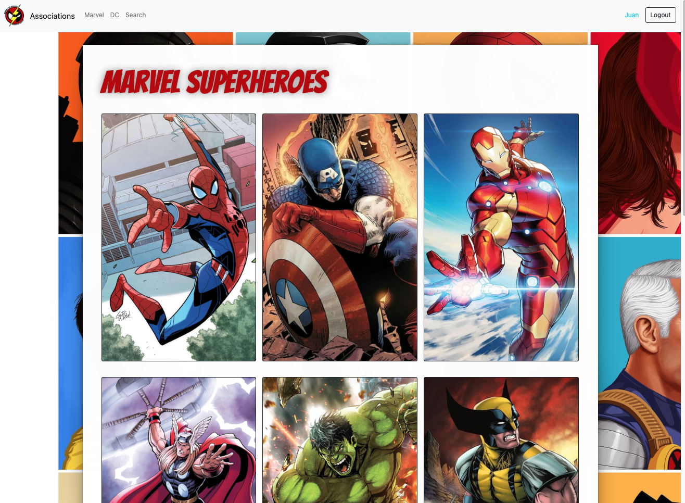

# This repository contains all projects made in one of the best React Courses at Udemy

# Projects

## Section 4. Counter App | Section 5.Unit Testing and Integration Testing

## Section 6. Gif Expert App - Application | Section 7. Deployment
What I learned from this section:
<ul>
  <li>Custom Hooks</li>
  <li>API Fetch</li>
  <li>Communication between Components</li>
  <li>CSS Classes</li>
  <li>Animations</li>
  <li>Send methods as arguments</li>
  <li>Create listings</li
  <li>Keys</li>
  <li>Giphy</li>
</ul>
 
After the development, I learned:
  
<ul>
  <li>How to do backups in GitHub Repos</li>
  <li>Upload GitHub Repo</li>
  <li>Deploy React App</li>
  <li>Generate production build of the App</li>
</ul>

## Section 9. React Hooks & Custom Hooks 🪝

Here I learned all these hooks! and look into real cases and where to use each of one in order to avoid re-rendering, and stuff...
<ul>
  <li>useState</li> 
  <li>useCounter</li>
  <li>useEfffect</li>
  <li>useEffect UnMount</li>
  <li>useFetch</li>
  <li>useRef</li>
  <li>useLayoutEffect</li>
  <li>useMemo</li>
  <li>memo (React function)</li>
  <li>useCallBack</li>
</ul>

## Section 10. useReducer

Here I learned how to make a to do app using reducer. Here it is an image from the course explaining reducer workflow. 
Topics for this sections are:
  <ul>
  <li>useReducer</li>
  <li>Reducers</li>
  <li>Reducers theory</li>
  <li>ToDo App</li>
  <li>Local CRUD</li>
</ul>

  

## Section 11. useContext
Here I learned how to use context in React.
<ul>
  <li>Context</li>
  <li>Provider</li>
  <li>useContext</li>
  <li>React Router</li>
  <li>Links y NavLinks</li>
  <li>CreateContext</li>
  <li>SPA ( Single Page Application )</li>
</ul>
The objective of this section was to learn how to use context in React.

## Section 14. Heroes App (Single Page Application) <a href="https://condescending-snyder-570e07.netlify.app/" rel="noopener noreferer" target="_blank">(link here)</a>
### ScreenShot of the App

 
Here I practiced the concepts previously learned in the course and:
<ul>
  <li>SPA ( Single Page Application ) a profundidad</li>
  <li>Diferentes themes applied to the same App but with diferent Routes</li>
  <li>Multiple routes</li>
  <li>Push/Replace in History (Navigate)</li>
  <li>Read arguments by URL</li>
  <li>Query Parameters</li>
  <li>Apply filters using query params</li>
</ul>

## Section 15. Protecting Routes
Here I learned how to protect routes in React.
This is a small section but important to work with the authentication and protection of our application.
<ul>
  <li>Protecting Routes</li>
  <li>Private Routes</li>
  <li>Public Routes</li>
  <li>Fake Login and Logout</li>
  <li>Store last path in local Storage</li>
  <li>Context</li>
  <li>useContext</li>
  <li>Reducer</li>
</ul>

## Section 17. Working with Images
Here I learned how to work with images in React and how to use them in the app, no matter if they are in the public folder or in the src folder.

## Section 18. Journal App
Here I built a journal app using React and learned:
<ul>
  <li></li>
  <li></li>
  <li></li>
  <li></li>
  <li></li>
</ul>